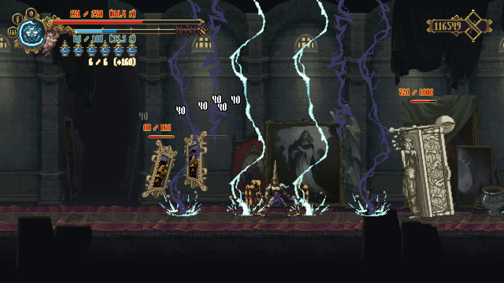

# Blasphemous: Damage Numbers Reborn
A remastered and augmented version of [@KZekai](https://next.nexusmods.com/profile/KZekai/mods "Kein's NexusMods home page")'s _Floating Damage Numbers_ mod for Blasphemous 1, now fully compatible with the modern [Blasphemous ModdingAPI](https://github.com/brandenEK/Blasphemous.ModdingAPI), while adding brand-new features and reborn in performance, aesthetics, and customizability!

---

## Features

 

- Displays various combat-related numbers, including:
  - floating damage numbers when Penitent or enemies are damaged
  - health numbers on top of enemy health bar
  - health numbers, health percentage, and recently-lost health around boss health bar
  - details & percentage number for Penitent's health, fervour, and flask
  - fixed-length health/fervour bar for Penitent
- Damage numbers come with different colors according to damage element type (physical, fire, magic, etc.) and its damage source (Penitent or enemy)
- Fully toggle-able and customizable from font, animation, to color. 
  - Toggle or customize functionalities through the config file in `[Blasphemous install menu]\Modding\config\Damage Numbers Reborn.cfg`

## Installation

This mod is available for download through the [Blasphemous Mod Installer](https://github.com/BrandenEK/Blasphemous.Modding.Installer)

Required dependencies (dependencies are auto-downloaded if installed through Mod Installer):
- [Modding API](https://github.com/BrandenEK/Blasphemous.ModdingAPI)
- [UI Framework](https://github.com/brandenEK/Blasphemous.Framework.UI)